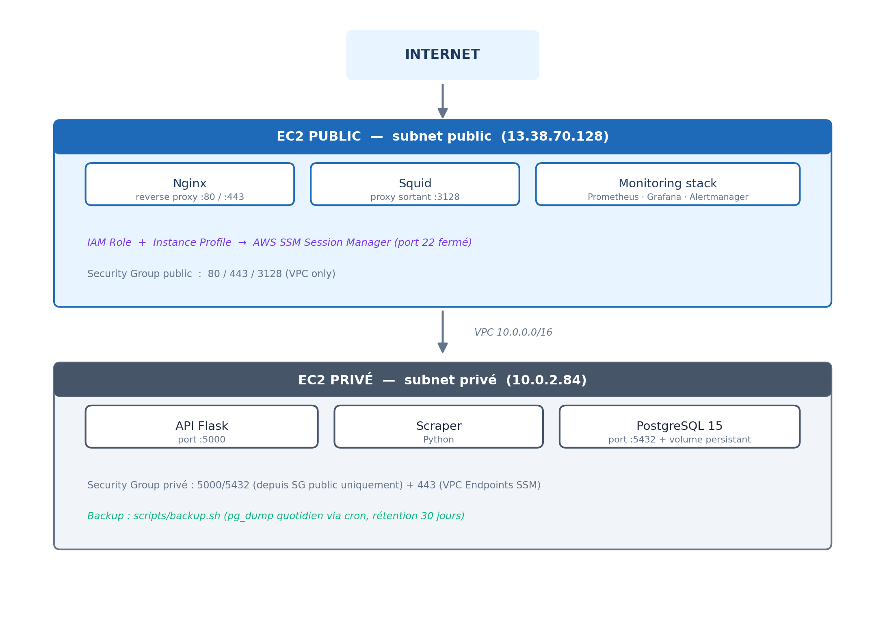
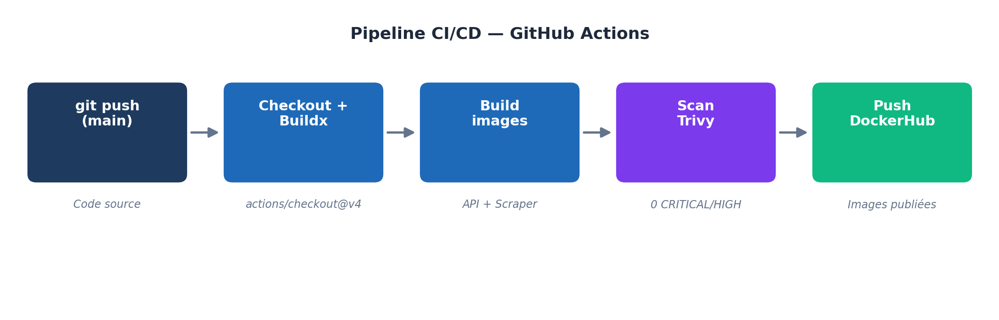

# Dossier de Projet — PlatformAlert
**Titre Professionnel** : Administrateur Systèmes DevOps  
**Candidate** : Fifame Machella Naomie Marie-Reine ADJOVI  
**Centre de formation** : École iT — Brussels  
**Session** : Mai 2026  
**Version** : 1.0  

---

## Résumé exécutif

**Contexte** : Dans un contexte e-commerce en pleine croissance, les 
consommateurs font face à des prix dynamiques qui varient plusieurs fois 
par jour sur des plateformes comme Amazon et la Fnac. Surveiller 
manuellement ces variations est chronophage et inefficace.

**Problème** : Il n'existe pas de solution open source, auto-hébergée 
et multi-plateformes permettant à un particulier de surveiller 
automatiquement les prix et d'être alerté en temps réel lors d'une baisse.

**Solution** : PlatformAlert est une application de surveillance 
automatique de prix e-commerce, déployée sur AWS, entièrement 
conteneurisée et supervisée. Elle scrape les prix toutes les 30 minutes, 
stocke l'historique sur 6 mois, expose les données via une API REST Flask, 
et notifie l'utilisateur par email lors d'une baisse de prix.

**Stack principale** : Python (Flask + Scraper) · PostgreSQL · Docker · 
AWS EC2/VPC · Terraform · Ansible · GitHub Actions · Prometheus · Grafana · Alertmanager

---

## Tableau des compétences REAC

| Bloc | Compétence | Preuve | Section |
|---|---|---|---|
| BC01 | CP1 — Scripts Bash | provision.sh, deploy.sh, monitor.sh | Section 4 |
| BC01 | CP2 — IaC Terraform + Ansible | main.tf, playbook.yml | Section 5 |
| BC01 | CP3 — Sécurité | SSM Session Manager, port 22 fermé | Section 6 |
| BC01 | CP4 — Mise en production | Ansible deploy sur EC2 | Section 5 |
| BC02 | CP1 — Environnement de test | Pipeline CI/CD avec Trivy | Section 7 |
| BC02 | CP2 — Stockage & Backup | Volume Docker + scripts/backup.sh (pg_dump + cron) | Section 8 |
| BC02 | CP3 — Containers | Dockerfiles API + Scraper | Section 8 |
| BC02 | CP4 — CI/CD | GitHub Actions deploy.yml | Section 7 |
| BC03 | CP1 — Métriques & KPI | 4 règles Prometheus définies | Section 9 |
| BC03 | CP2 — Supervision | Prometheus + Grafana + Alertmanager | Section 9 |

> ✅ Les 3 compétences obligatoires sont couvertes :
> 1. Automatiser l'infrastructure (BC01)
> 2. Gérer les containers (BC02)
> 3. Supervision (BC03)

---

## 1. Cahier des charges

### 1.1 Contexte métier

Les plateformes e-commerce comme Amazon et la Fnac pratiquent une 
politique de prix dynamique : les tarifs varient plusieurs fois par jour 
en fonction de la demande, des stocks et des promotions. Un consommateur 
qui souhaite acheter un produit au meilleur prix doit surveiller 
manuellement et régulièrement ces variations — une tâche fastidieuse 
et chronophage.

### 1.2 Problématique

Comment permettre à un particulier de surveiller automatiquement 
l'évolution des prix de produits e-commerce et d'être alerté en temps 
réel lorsqu'une opportunité d'achat se présente ?

### 1.3 Alternatives existantes et leurs limites

| Outil | Limites |
|---|---|
| CamelCamelCamel | Limité à Amazon uniquement |
| Keepa | Fonctionnalités avancées payantes |
| Alertes manuelles | Chronophage, pas d'historique centralisé |

PlatformAlert se distingue par son architecture open source, 
auto-hébergée et multi-plateformes.

### 1.4 Objectifs chiffrés

| Objectif | Valeur cible |
|---|---|
| Produits surveillés simultanément | 100 produits |
| Fréquence de scraping | Toutes les 30 minutes |
| Délai d'alerte après baisse de prix | Moins de 30 minutes |
| Historique des prix conservé | 6 mois glissants |
| Disponibilité de l'API | 99% uptime |

### 1.5 Contraintes

| Contrainte | Détail |
|---|---|
| Budget | AWS Free Tier exclusivement |
| Ressources | Projet développé en solo |
| Délai | 8 semaines |
| Sécurité | Aucun secret en clair, séparation réseau public/privé |

---

## 2. Architecture technique

### 2.1 Vue d'ensemble

### 2.1 Vue d'ensemble


### 2.2 Pipeline CI/CD


### 2.3 Stack technique complète

| Composant | Technologie | Justification |
|---|---|---|
| Scraper | Python | Bibliothèques scraping matures |
| API | Flask (Python) | Léger, suffisant pour le périmètre |
| Base de données | PostgreSQL 15 | Robuste, multi-conteneurs |
| Conteneurisation | Docker + Compose | Portabilité, isolation |
| Infrastructure | AWS EC2, VPC, SG | Free Tier disponible |
| IaC | Terraform | Reproductible, versionné |
| Configuration | Ansible | Agentless, simple |
| CI/CD | GitHub Actions | Intégré à GitHub, gratuit |
| Monitoring | Prometheus + Grafana | Open source, flexible |
| Alerting | Alertmanager | Natif Prometheus, email |
| Reverse proxy | Nginx | Standard, performant |
| Proxy sortant | Squid | Gratuit, alternative NAT Gateway |
| Accès sécurisé | AWS SSM Session Manager | Sans port 22 ouvert |

---

## 3. BC01 — Automatiser l'infrastructure

### 3.1 Scripts Bash (CP1)

Trois scripts ont été développés pour automatiser les opérations courantes :

**provision.sh** — Installation de l'environnement Docker sur un serveur Ubuntu vierge.
- Mise à jour système
- Installation des dépendances
- Installation de Docker CE
- Vérification finale

**deploy.sh** — Déploiement de l'application PlatformAlert.
- Vérification des prérequis
- Pull des images Docker
- Arrêt des conteneurs existants
- Lancement via docker compose
- Vérification de l'état

**monitor.sh** — Supervision de l'état des services.
- État des conteneurs Docker
- Vérification HTTP de l'API, Prometheus et Grafana
- Utilisation CPU/mémoire par conteneur
- Espace disque avec seuil d'alerte

```bash
# Exemple d'utilisation
sudo bash scripts/provision.sh    # Provisionner un serveur
bash scripts/deploy.sh            # Déployer l'application
bash scripts/monitor.sh           # Superviser les services
```

### 3.2 Infrastructure as Code avec Terraform (CP2)

Terraform provisionne l'intégralité de l'infrastructure AWS :

```hcl
# Exemple — EC2 avec IAM Role SSM
resource "aws_instance" "public" {
  ami                    = "ami-0cc28c9caf9c41c2d"
  instance_type          = "t3.micro"
  subnet_id              = aws_subnet.public.id
  vpc_security_group_ids = [aws_security_group.public.id]
  key_name               = aws_key_pair.deployer.key_name
  iam_instance_profile   = aws_iam_instance_profile.ssm_profile.name

  tags = {
    Name    = "platformalert-nginx"
    Project = "platformalert"
  }
}
```

**Ressources provisionnées :**
- VPC `10.0.0.0/16` avec DNS activé
- Subnet public `10.0.1.0/24` + subnet privé `10.0.2.0/24`
- Internet Gateway + Route Tables
- Security Groups (public : 80/443/3128 — privé : 5000/5432/443)
- 2 EC2 Ubuntu 22.04 t3.micro
- IAM Role + Instance Profile pour SSM
- VPC Endpoints SSM (ssm, ssmmessages, ec2messages)
- Key Pair SSH

**Résultat :** Infrastructure reproductible en 3 minutes. 
Versionnée dans Git. Zéro configuration manuelle.

### 3.3 Configuration avec Ansible (CP2)

Le playbook Ansible configure les deux EC2 après provisionnement Terraform :

**Play 1 — EC2 public (Nginx + Squid + Docker)**
- Installation Docker CE via repository officiel
- Installation et configuration Nginx
- Installation et configuration Squid proxy
- Handlers pour redémarrage automatique

**Play 2 — EC2 privé (App)**
- Configuration proxy apt (via Squid)
- Configuration proxy système et Docker
- Installation Docker CE
- Copie des fichiers applicatifs
- Lancement via docker compose

```bash
# Lancement du playbook
ansible-playbook -i ansible/inventory.ini ansible/playbook.yml
```

---

## 4. BC01 — Sécurité (CP3)

### 4.1 Suppression du port SSH

**Problème initial :** Le port 22 était ouvert à `0.0.0.0/0` — 
exposé à toutes les attaques brute-force sur internet.

**Solution mise en place :** AWS SSM Session Manager.

```hcl
# IAM Role pour SSM — aucun port SSH nécessaire
resource "aws_iam_role_policy_attachment" "ssm_policy" {
  role       = aws_iam_role.ssm_role.name
  policy_arn = "arn:aws:iam::aws:policy/AmazonSSMManagedInstanceCore"
}
```

**Avantages :**
- Aucun port 22 ouvert sur les Security Groups
- Pas de gestion de clés SSH
- Audit complet dans AWS CloudTrail
- Gratuit, inclus dans le Free Tier

```bash
# Connexion sans SSH
aws ssm start-session \
  --target i-076746a6829b426bd \
  --region eu-west-3
```

### 4.2 Séparation réseau public/privé

- EC2 public : accessible depuis internet (ports 80/443)
- EC2 privé : accessible uniquement depuis le subnet public
- PostgreSQL : port 5432 uniquement depuis le Security Group public
- API Flask : port 5000 uniquement depuis le Security Group public

### 4.3 Gestion des secrets

- Credentials Docker Hub stockés dans les **GitHub Actions Secrets**
- Variables d'environnement PostgreSQL dans un fichier `.env` 
  (exclu du repo via `.gitignore`)
- Mot de passe Grafana en variable d'environnement
- Mot de passe Alertmanager (Gmail App Password) non versionné

### 4.4 Scan de sécurité des images

Trivy scanne les images Docker à chaque push :
platformalert-api:latest    → 0 vulnérabilité CRITICAL/HIGH ✅
platformalert-scraper:latest → 0 vulnérabilité CRITICAL/HIGH ✅

---

## 5. BC02 — Containers & CI/CD

### 5.1 Dockerfiles

**API Flask :**

```dockerfile
FROM python:3.11-slim
WORKDIR /app
COPY requirements.txt .
RUN pip install --no-cache-dir --upgrade pip setuptools wheel && \
    pip install --no-cache-dir -r requirements.txt
COPY . .
EXPOSE 5000
CMD ["python", "app.py"]
```

**Scraper Python :**

```dockerfile
FROM python:3.11-slim
WORKDIR /app
RUN pip install --no-cache-dir --upgrade pip setuptools wheel
COPY . .
CMD ["python", "-u", "scraper.py"]
```

### 5.2 Docker Compose

```yaml
services:
  db:
    image: postgres:15
    environment:
      POSTGRES_USER: ${POSTGRES_USER}
      POSTGRES_PASSWORD: ${POSTGRES_PASSWORD}
      POSTGRES_DB: ${POSTGRES_DB}
    volumes:
      - postgres_data:/var/lib/postgresql/data

  api:
    build:
      context: ./api
      args:
        HTTP_PROXY: http://10.0.1.137:3128/
        HTTPS_PROXY: http://10.0.1.137:3128/
    ports:
      - "5000:5000"

  scraper:
    build:
      context: ./scraper
      args:
        HTTP_PROXY: http://10.0.1.137:3128/
        HTTPS_PROXY: http://10.0.1.137:3128/
    command: python scraper.py
```

### 5.3 Pipeline CI/CD GitHub Actions

```yaml
name: CI/CD PlatformAlert
on:
  push:
    branches: [main]

jobs:
  build-and-push:
    runs-on: ubuntu-latest
    env:
      FORCE_JAVASCRIPT_ACTIONS_TO_NODE24: true
    steps:
      - uses: actions/checkout@v4
      - uses: docker/setup-buildx-action@v3
      - uses: docker/login-action@v3
      - uses: docker/build-push-action@v6  # Build + Push API
      - uses: docker/build-push-action@v6  # Build + Push Scraper
      - uses: aquasecurity/trivy-action@v0.35.0  # Scan API
      - uses: aquasecurity/trivy-action@v0.35.0  # Scan Scraper
```

**Résultat :** Chaque push sur `main` déclenche automatiquement 
le build, le scan sécurité et le push sur DockerHub.

---

## 6. BC03 — Supervision

### 6.1 KPI définis

| Métrique | Seuil d'alerte | Justification |
|---|---|---|
| CPU | > 80% pendant 2 min | Au-delà, le scraper ralentit significativement |
| Mémoire | > 85% pendant 2 min | Risque d'OOM killer sur t3.micro (1GB RAM) |
| API indisponible | 1 min de downtime | SLA 99% = max 7h/an d'indisponibilité |
| Espace disque | > 80% pendant 5 min | 6 mois d'historique = ~2GB estimé |

### 6.2 Règles Prometheus

```yaml
groups:
  - name: platformalert.rules
    rules:
      - alert: CPUElevee
        expr: 100 - (avg by(instance) 
          (rate(node_cpu_seconds_total{mode="idle"}[5m])) * 100) > 80
        for: 2m
        labels:
          severity: warning

      - alert: APIIndisponible
        expr: up{job="platformalert-api"} == 0
        for: 1m
        labels:
          severity: critical
```

### 6.3 Stack monitoring

```yaml
services:
  prometheus:    # Collecte des métriques — port 9090
  alertmanager:  # Gestion des alertes — port 9093
  grafana:       # Dashboards — port 3000
  node-exporter: # Métriques système — port 9100
```

### 6.4 Test d'alerte bout en bout

**Test réalisé le 13 mai 2026 :**

1. Lancement stress CPU : `stress-ng --cpu 2 --timeout 600s`
2. Prometheus détecte CPU > 80% → alerte en `pending`
3. Après 2 minutes → alerte en `firing`
4. Alertmanager envoie l'email via Gmail SMTP
5. Email reçu sur `adjovififame@gmail.com` ✅

**Preuve :** Capture d'écran Prometheus alerts + email reçu 
(voir Annexe A)

---

## 7. Difficultés rencontrées et solutions

### 7.1 Accès internet depuis le subnet privé

**Symptôme :** L'EC2 privé ne peut pas télécharger les packages 
Docker. La NAT Gateway AWS coûte ~32$/mois — incompatible Free Tier.

**Hypothèses testées :**
- NAT Gateway managée → trop coûteuse ❌
- Tout déployer sur EC2 public → perd la séparation réseau ❌
- Proxy Squid sur EC2 public → gratuit, sous contrôle ✅

**Solution retenue :**
/etc/squid/squid.conf
http_port 3128
acl localnet src 10.0.0.0/16
http_access allow CONNECT SSL_ports
http_access allow localnet

**Résultat :** EC2 privé accède à internet via proxy Squid. 
Séparation public/privé conservée. Coût : 0€.

### 7.2 Port SSH et IP dynamique

**Symptôme :** IP personnelle change à chaque connexion réseau — 
impossible de restreindre le port 22 à une IP fixe.

**Solution retenue :** AWS SSM Session Manager — suppression totale 
du port 22. Connexion via API AWS sans exposition réseau.

**Résultat :** Security Groups sans port 22 ouvert. 
Audit complet dans CloudTrail.

### 7.3 Versions GitHub Actions dépréciées

**Symptôme :** Actions sur Node.js 20, dépréciées depuis juin 2026.

**Solution :** Mise à jour vers versions Node.js 24 :
- `actions/checkout@v3` → `@v4`
- `docker/login-action@v2` → `@v3`
- `docker/build-push-action@v5` → `@v6`

### 7.4 Vulnérabilités Trivy dans les images

**Symptôme :** 3 vulnérabilités HIGH détectées dans `setuptools` 
et `wheel` (CVE-2026-23949, CVE-2026-24049).

**Solution :** Mise à jour explicite dans le Dockerfile :
```dockerfile
RUN pip install --no-cache-dir --upgrade pip setuptools wheel
```

**Résultat :** 0 vulnérabilité CRITICAL/HIGH. Pipeline vert. ✅

---

## 8. Bilan

### Ce qui fonctionne

- Infrastructure AWS déployée et stable
- Pipeline CI/CD entièrement automatisé, 0 vulnérabilité
- Alerting testé bout en bout — email reçu en moins de 3 minutes
- Accès sécurisé via SSM — port 22 supprimé
- Proxy Squid — alternative gratuite à la NAT Gateway
- Sauvegarde PostgreSQL automatisée — script backup.sh + cron quotidien

### Limites du projet

- L'API Flask n'expose pas encore de métriques `/metrics`
  pour Prometheus
- Pas d'environnement staging distinct
- Scraping limité — pas de vraies données e-commerce en production
- Pas de multi-région AWS (contrainte budget Free Tier)
- Backup local uniquement — pas encore répliqué hors EC2

### Améliorations possibles

- Ajouter `prometheus_flask_exporter` pour exposer les métriques API
- Créer un environnement staging sur branche `dev`
- Intégrer CloudFront CDN pour les assets statiques
- Uploader les backups PostgreSQL vers S3 avec lifecycle policy
- Envisager Kubernetes pour le scaling horizontal

### 8.4 Sauvegarde PostgreSQL

Un script `backup.sh` automatise la sauvegarde de la base de données :

- Dump via `pg_dump` dans le conteneur PostgreSQL, compressé en `.sql.gz`
- Exécution quotidienne via cron (3h du matin) sur l'EC2 privé
- Rétention de 30 jours, nettoyage automatique des backups expirés
- Procédure de restauration documentée dans `docs/backup-procedure.md`

```bash
0 3 * * * /opt/platformalert/scripts/backup.sh >> /var/log/platformalert-backup.log 2>&1
```

**Amélioration future** : upload automatique vers S3 avec lifecycle policy 
pour une résilience accrue en cas de perte de l'EC2.
---

## Annexes

### Annexe A — Captures d'écran
- Prometheus alerts page (CPUElevee en firing)
- Email Alertmanager reçu
- GitHub Actions pipeline vert
- Grafana dashboard

### Annexe B — Fichiers Terraform
Voir `terraform/main.tf`, `variables.tf`, `outputs.tf`

### Annexe C — Playbook Ansible
Voir `ansible/playbook.yml`

### Annexe D — Pipeline CI/CD
Voir `.github/workflows/deploy.yml`
